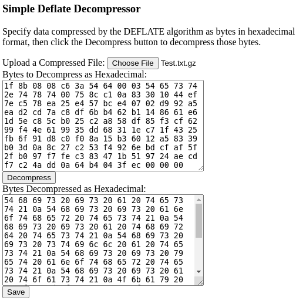

SimpleDeflateDecompressor
=========================

A simple decompressor for data compressed using the DEFLATE algorithm
implemented in TypeScript.

Provenance
----------

This repository was originally forked from the implementation by
Nayuki Minase at the URL:

	https://github.com/nayuki/Simple-DEFLATE-decompressor

That upstream repository also contains implementations in the languages
C++, Java, and Python that have been discarded in this fork. 
The TypeScript code was retained, but it has had its file structure
reorganized, has been reformatted to different, idiosyncratic
coding standards, and, in some cases, has been slightly refactored.
A simple HTML user interface has also been added, which may have be
originally the result of a long-ago port from an earlier, pre-GitHub version
of this code by the same author.

Running
-------

To see the decompressor in action, open the
SimpleDeflateDecompressor.html file in a web browser that runs JavaScript,
upload a .gz file compressed using DEFLATE, click the Decompress button,
then click the Save button, specify a save location, and finally, open
up the decompressed file and verify it is the same as the original one.

Building
--------

Run the command "tsc" from within the Source directory.  Note that,
as of this writing, certain parts of the app are already in JavaScript
rather than TypeScript, in .js or .html files.  Ideally most of this
would be eventually be moved to .ts files.
